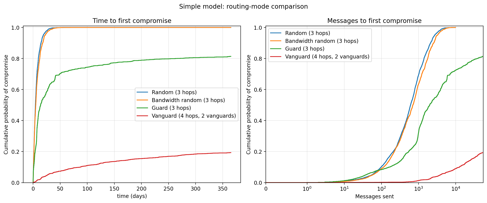
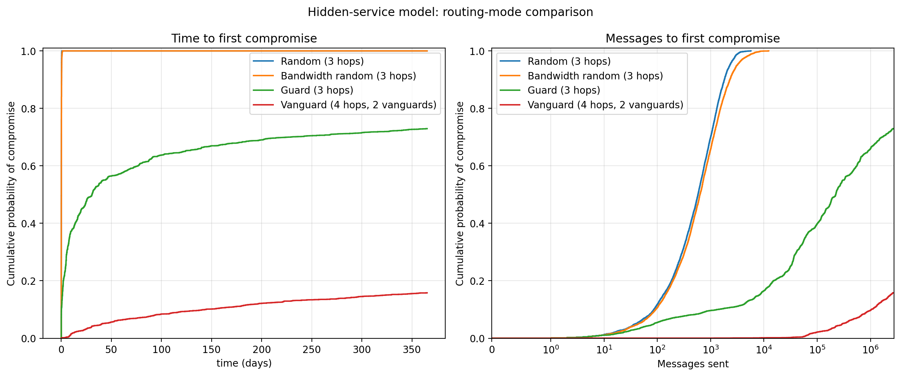
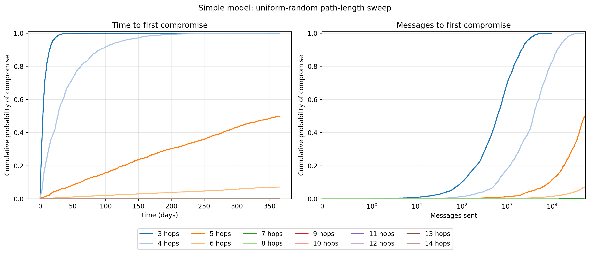

# freeroutesim results

In the simulation here we consider a path compromised only when every hop is malicious. Each user stops after their first compromised path. users without a compromise run for the full 365 days.

We used the following constant params:

| Parameter                           | Value |
|-------------------------------------| ---: |
| Users                               | 5,000 |
| duration                            | 365 days |
| Topology epoch lifetime             | 3,600 seconds |
| path length                         | 3 hops |
| Vanguard path length                | 4 hops, including 2 vanguards and 1 guard |
| Malicious node fraction target      | 0.10 |
| Malicious bandwidth fraction target | 0.10 |
| Churn probability per epoch         | 0.03 |

Both user models were tested with `random`, `bandwidth-random`, `guard`, and `vanguard` routing. The vanguard sampler requires the number of vanguards to be less than `hops - 1`, so its experiments use four hops and two vanguards rather than the three-hop configuration used by the other modes.

## Run summaries

| Model | Mode | Hops | Compromised after 365 days |
| --- | --- | ---: | ---: |
| Simple | Random | 3 | 100.00% |
| Simple | Bandwidth random | 3 | 100.00% |
| Simple | Guard | 3 | 81.38% |
| Simple | Vanguard (2) | 4 | 19.34% |
| Hidden service | Random | 3 | 100.00% |
| Hidden service | Bandwidth random | 3 | 100.00% |
| Hidden service | Guard | 3 | 72.94% |
| Hidden service | Vanguard (2) | 4 | 15.80% |
| Simple | Random | 14 | 0.00% |

## Uniform-random with different path-length 

The simple model was also run in uniform-random mode for every path length from 3 through 14 hops. All other parameters match the ones listed above.

| Hops | Compromised users | Compromised after 365 days | Total messages processed |
| ---: | ---: | ---: | ---: |
| 3 | 5,000 | 100.00% | 4,480,737 |
| 4 | 5,000 | 100.00% | 28,197,495 |
| 5 | 2,495 | 49.90% | 191,932,617 |
| 6 | 359 | 7.18% | 253,472,958 |
| 7 | 21 | 0.42% | 262,498,767 |
| 8 | 1 | 0.02% | 262,978,430 |
| 9 | 0 | 0.00% | 263,015,009 |
| 10 | 0 | 0.00% | 263,016,691 |
| 11 | 0 | 0.00% | 263,020,669 |
| 12 | 0 | 0.00% | 263,015,369 |
| 13 | 0 | 0.00% | 263,014,927 |
| 14 | 0 | 0.00% | 263,020,495 |

## Figures

### Simple model: 

### Hidden-service model:

### Uniform-random path:

