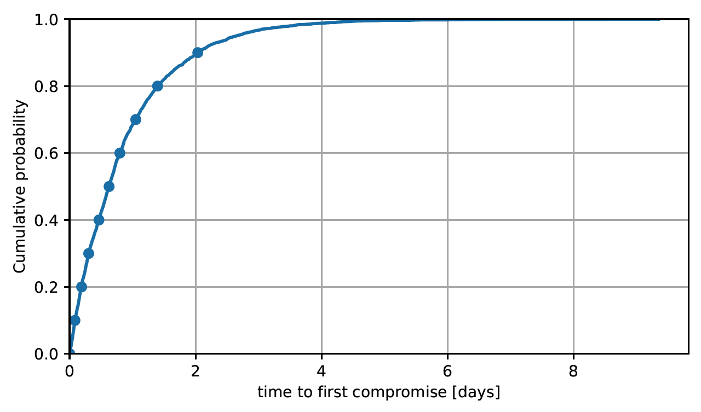
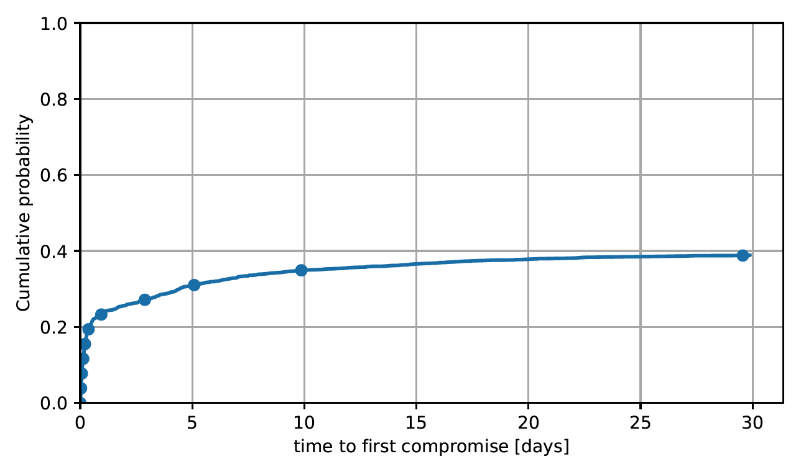
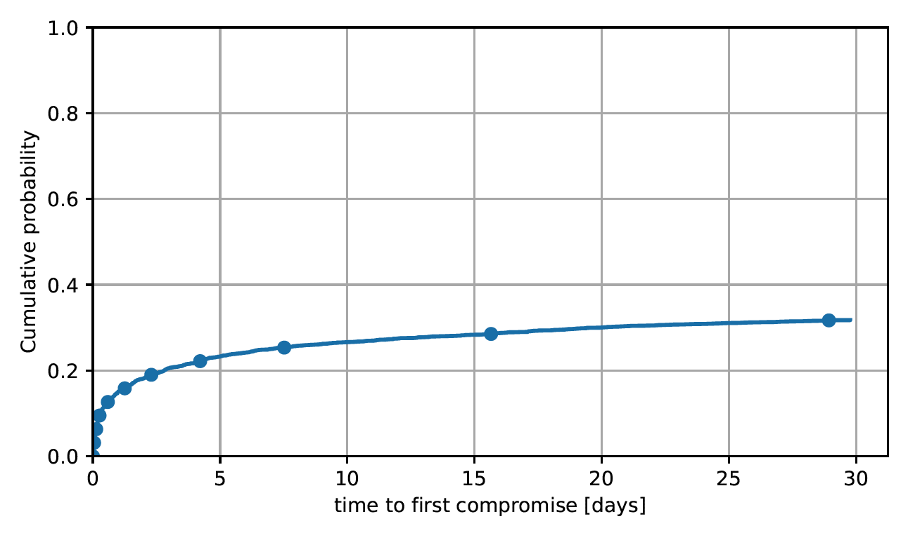
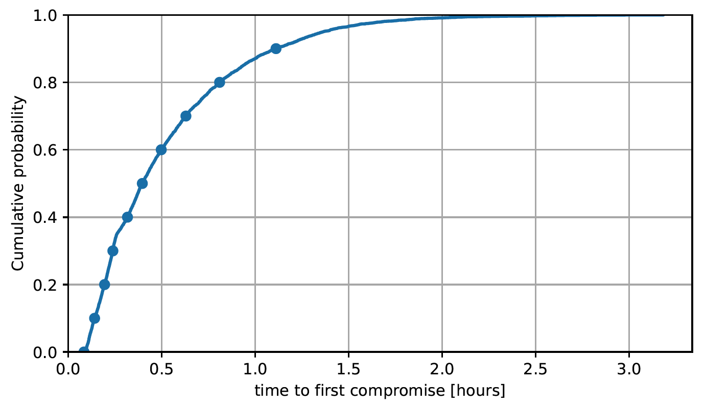
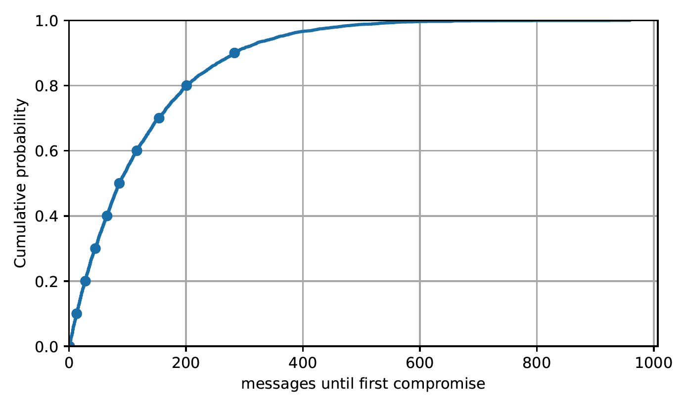

## Simple Model

### without guards
Summary:
- users=5000
- days=30
- total_messages=21616205
- compromised_users=5000
- percentage_compromised_users=100.000000

### with guards
Summary:
- users=5000
- days=30
- total_messages=21612322
- compromised_users=1943
- percentage_compromised_users=38.860000

the result seem to be around 0.4 probably
because we have 10% adversary control and a set of 5 guards which we sample.
changing these will probably change outcome. 

### with guards and vanguards
Summary:
- users=5000
- days=30
- total_messages=21616884
- compromised_users=1589
- percentage_compromised_users=31.780000

## hidden service Model

### without guards
Summary:
- users=5000
- days=1
- total_messages=36224095
- compromised_users=5000
- percentage_compromised_users=100.000000

### with guards
Summary:
- users=5000
- days=30
- total_messages=1090812738
- compromised_users=2165
- percentage_compromised_users=43.300000

TODO: generating figures takes too long, need to fix few things.

### with guards and vanguards

Summary:
- users=5000
- days=30
- total_messages=1090615016
- compromised_users=1720
- percentage_compromised_users=34.400000

